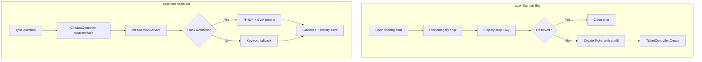

# AI Chatbot Integration Guide

## Overview

Two chatbots are integrated into **IT-Ticket-Booking-System-Latest** without changing admin flows or existing ticket logic:

| Bot | Role | UI | AI |
|-----|------|----|----|
| User Support Bot | `User` | Floating widget, click-only quick replies | FAQ steps from `support_faqs` |
| Engineer Assistant | `Agent` | Same widget, text input | TF-IDF + SVM via Flask `ai-service` |

## Folder structure

```
Controllers/ChatbotController.cs
Models/SupportFaq.cs, UserChatHistory.cs, EngineerChatHistory.cs, SupportCategories.cs
Repositories/IChatbotRepository.cs, ChatbotRepository.cs
Services/IChatbotService.cs, ChatbotService.cs, IMlPredictionService.cs, MlPredictionService.cs
Options/MlServiceOptions.cs
DTOs/ChatbotDtos.cs
Data/SupportFaqSeedData.cs
Views/Shared/_ChatbotPartial.cshtml
wwwroot/css/chatbot.css
wwwroot/js/chatbot.js
ai-service/app.py
Database/mysql/chatbot_tables.sql
Migrations/20260524120000_AddChatbotTables.cs
```

## System workflow



## AI / NLP prediction flow

1. Engineer submits natural language query (AJAX POST).
2. `MlPredictionService` calls Flask `POST /api/predict` with `{ "text": "..." }`.
3. Flask preprocesses text, runs **TfidfVectorizer → LinearSVC** pipeline, returns category + guidance.
4. `ChatbotService` merges ML output with FAQ steps when needed and persists `engineer_chat_history`.
5. If Flask is down and `MlService:EnableFallback` is `true`, keyword rules classify Network / Software / Hardware.

## Ticket integration

- User bot **Create Ticket** navigates to `/Ticket/Create?title=...&description=...&problemType=0|1|2`.
- `TicketController.Create` (GET) pre-fills `TicketCreateVm` — no change to POST/create pipeline.
- Categories map to `ProblemType` via `SupportCategories.MapToProblemType`.

## Database

- **Runtime (this repo):** SQL Server via EF Core migration `AddChatbotTables`.
- **MySQL (documentation / alternate deploy):** run `Database/mysql/chatbot_tables.sql`.
- FAQs seed automatically in `DbSeeder` when table is empty.

## Setup steps

### 1. Apply migration

```bash
cd IT_ticketbooking/IT-Ticket-Booking-System-Latest
dotnet ef database update
```

### 2. Start Flask ML service

```bash
cd ai-service
python -m venv .venv
.venv\Scripts\activate   # Windows
pip install -r requirements.txt
python app.py
```

Default URL: `http://127.0.0.1:5001` (configured in `appsettings.json` → `MlService`).

### 3. Run ASP.NET app

```bash
dotnet run
```

Log in as `user@it.local` / `User@123` (user bot) or `alex.agent@it.local` / `Agent@123` (engineer bot).

## API endpoints

| Method | Route | Role |
|--------|-------|------|
| GET | `/Chatbot/config` | User, Agent |
| GET | `/Chatbot/user/guide?category=` | User |
| GET | `/Chatbot/user/history` | User |
| POST | `/Chatbot/engineer/ask` | Agent |

## Review talking points

- **Reduces tickets:** Users complete guided fixes before escalating.
- **Shows AI:** Engineer bot exposes TF-IDF + SVM pipeline and confidence in responses.
- **Non-invasive:** Admin pages unchanged; existing `TicketService` untouched.
- **Session hygiene:** Closing the popup clears client UI state; history remains in DB for analytics.
