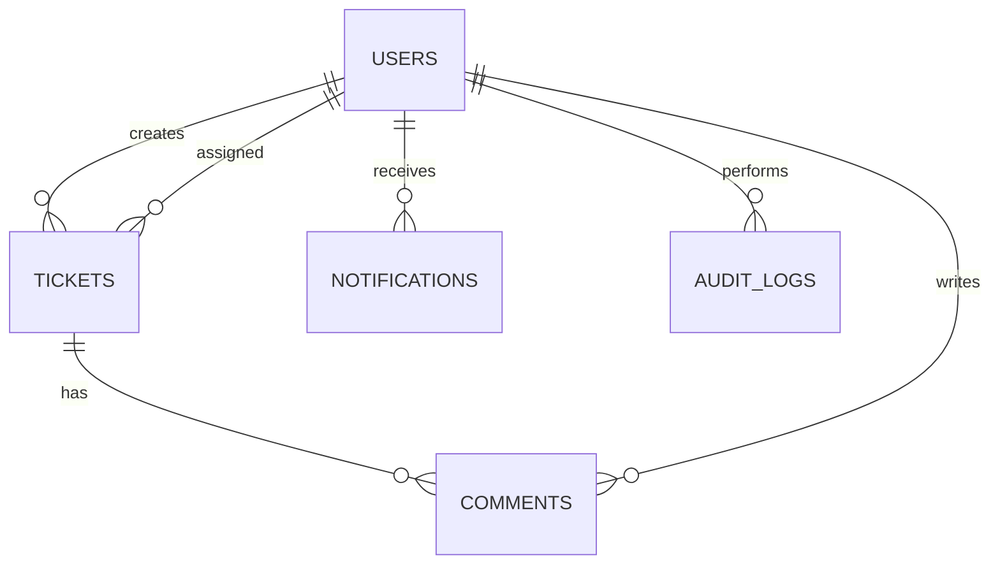

# Architecture
- Monorepo: apps/api + apps/web + docs + tests + infra
- Backend: Express MVC + PostgreSQL + JWT RBAC + security middleware
- Frontend: Next.js + Tailwind responsive dashboard
- Infra: Docker Compose with Postgres, Redis, API, Web

